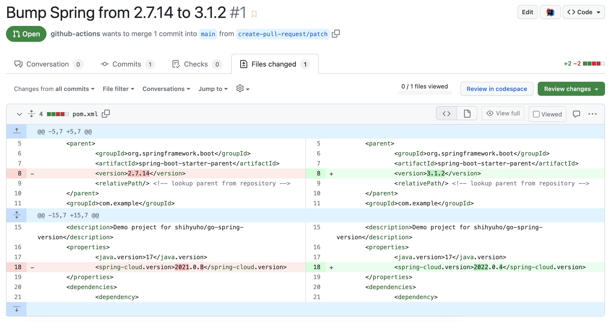

# Get the latest Spring version in Go

[](https://goreportcard.com/report/github.com/shihyuho/go-spring-version)

Get the latest Spring Boot version and its associated BOM versions, such as Spring Cloud, written in Go.

## Usage

### Input Variables

| Name | Description |
|------|-------------|
| boot-url | URL of Spring Boot metadata (default: `https://api.spring.io/projects/spring-boot/releases`) |
| starter-url | URL of Starter metadata (default: `https://start.spring.io`) |
| insecure | `true/false`, allow insecure metadata server connections when using SSL (default: `false`) |
| boot-version | Spring Boot version, uses the current version if left blank. Supports semver comparison, e.g. `~3.x`, see ["Checking Version Constraints"](https://github.com/Masterminds/semver#checking-version-constraints) for more details. |
| dependencies | List of dependency identifiers to include in the generated project, can separate with commas, e.g. `cloud-starter` |
| verbose | `true/false`, provides additional detailed [outputs](#outputs), often used for debugging purposes |

### Outputs

This action provides an output of the BOM versions managed by Spring, which includes the following:

- `spring-boot`
- `spring-cloud`
- `spring-cloud-azure`
- `spring-cloud-gcp`
- `spring-cloud-services`
- `spring-modulith`
- `spring-shell`
- `codecentric-spring-boot-admin`
- `hilla`
- `sentry`
- `solace-spring-boot`
- `solace-spring-cloud`
- `testcontainers`
- `vaadin`
- `wavefron`

You can refer to the `outputs` section of [action.yml](action.yml) file for more details.

### Example

The following example workflow fetches the latest version and then checks the current version. If it spots any differences between the two, it triggers an update and creates a pull request.

```yaml
jobs:
  latest-version:
    runs-on: ubuntu-latest
    steps:
      - id: get-spring-version
        uses: shihyuho/go-spring-version@v1
        with:
          boot-version: "~3.x"
          dependencies: "cloud-starter"
    outputs:
      spring-boot: ${{ steps.get-spring-version.outputs.spring-boot }}
      spring-cloud: ${{ steps.get-spring-version.outputs.spring-cloud }}

  current-version:
    runs-on: ubuntu-latest
    steps:
      - uses: actions/checkout@v3
        with:
          fetch-depth: 0
      - uses: actions/setup-java@v3
        with:
          java-version: '17'
          distribution: 'temurin'
          cache: 'maven'
      - id: get-current-version
        run: echo "version=$(mvn help:evaluate -Dexpression=project.parent.version -q -DforceStdout -q)" >> "$GITHUB_OUTPUT"
    outputs:
      spring-boot: ${{ steps.get-current-version.outputs.version }}

  bump-spring:
    runs-on: ubuntu-latest
    permissions:
      contents: write
      pull-requests: write
    needs: [latest-version, current-version]
    if: "${{ needs.latest-version.outputs.spring-boot != needs.current-version.outputs.spring-boot }}"
    steps:
      - uses: actions/checkout@v3
        with:
          fetch-depth: 0
      - uses: actions/setup-java@v3
        with:
          java-version: '17'
          distribution: 'temurin'
          cache: 'maven'
      - name: Bump version
        run: |
          mvn versions:update-parent "-DparentVersion=[${{ needs.latest-version.outputs.spring-boot }}]"
          mvn versions:set-property "-Dproperty=spring-cloud.version" -DnewVersion=${{ needs.latest-version.outputs.spring-cloud }}
          mvn versions:commit
      - name: Create Pull Request
        uses: peter-evans/create-pull-request@v5
        with:
          commit-message: "chore: bump spring from ${{ needs.current-version.outputs.spring-boot }} to ${{ needs.latest-version.outputs.spring-boot }}"
          title: "Bump Spring from ${{ needs.current-version.outputs.spring-boot }} to ${{ needs.latest-version.outputs.spring-boot }}"
          body: >-
            Bumps [spring-projects/spring-boot](https://github.com/spring-projects/spring-boot)
            from ${{ needs.current-version.outputs.spring-boot }} to ${{ needs.latest-version.outputs.spring-boot }}
```

Based on the example above, the code diff for bumping Spring might look like this:




